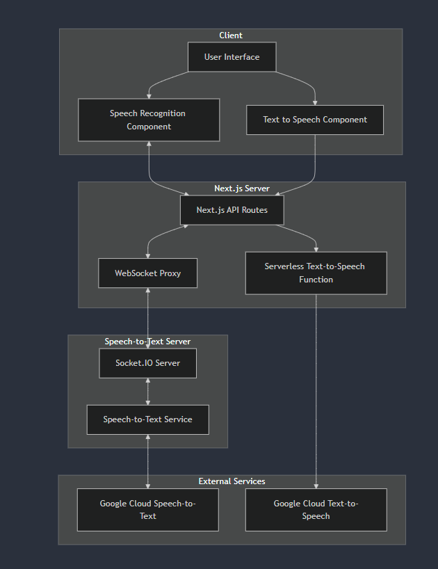
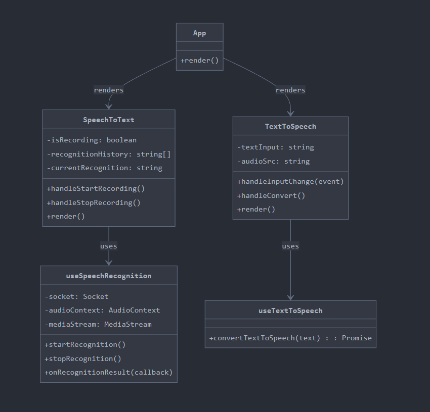

# Speech to Text and Text to Speech App

## Using Google Cloud Speech-to-Text and Text-to-Speech APIs

## Overview





### How to run the app

1. Clone the repository
2. Install the required packages
3. Run the app

```bash
npm run dev
```

### run backend

clone the backend repository : https://github.com/Tejs1/audio-to-text-backend
